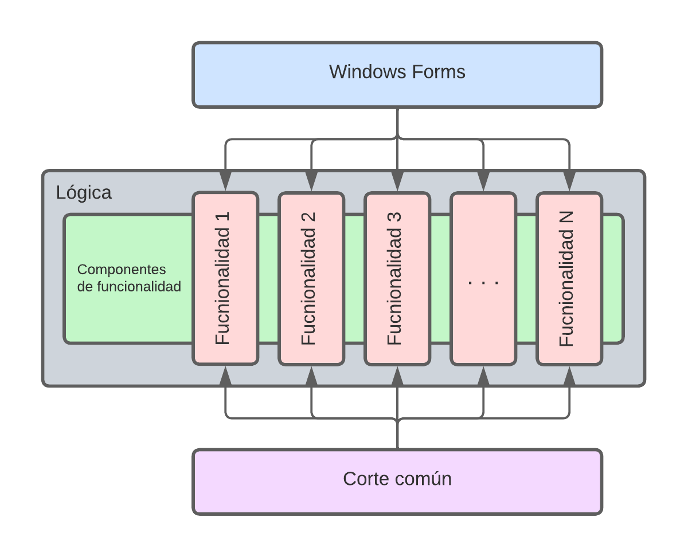

# Windows Forms con vertical slices y metodología Scrum
En este repositorio se encuentra el código de ejemplo de como emplear vertical slices en una aplicación de Windows Forms, así como la metodología Scrum para la gestión de proyectos.

## Sobre el sistema
Para entender el sistema, hay que tener en cuenta que es un sistema basico, orientado a la gestión de preguntas. 

Teniendo eso en consideración, continuemos.

## ¿Cómo se hizo el levantamiento?
El levantamiento se realizo con la metodología Scrum, por lo que se tiene un documento de historias de usuario, en la raíz del sistema. Allí esta el detalle de las mismas, así como los escenarios y criterios de aceptación de cada uno. 

Este documento cuenta como el alcance del proyecto, si bien esta hecho en .docx, lo recomendado es hacerlo con herramientas que permitan el seguimiento de las historias de usuario, como Azure DevOps, Jira, Trello, etc.

## Arquitectura del proyecto

El proyecto esta basado en la siguiente arquitectura, de nombre vertical Slices:

Cada historia de usuario es una funcionalidad, autocontenida y con baja cohesión una de otras. 

Unicamente se comparten los elementos de corte común, como son la validación, el registro de 
eventos, el manejo de excepciones, acceso a base de datos, etc.

Esto, esta implementado en 4 proyectos:
* WinFormsSample: Es el proyecto principal de la aplicación, presenta la interfaz de 
usuario empleando la tecnologia Windows Forms
* Lógica: Es el proyecto que contiene la lógica de negocio de la aplicación, dividida en
funcionalidades
* Corte Común: Es el proyecto que contiene los elementos de corte común de la aplicación:
* Dominio: Es el proyecto que contiene las entidades de dominio de la aplicación
